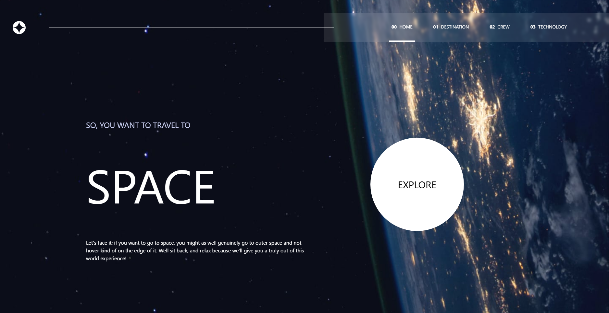

# Frontend Mentor - Space tourism website solution

This is a solution to the [Space tourism website challenge on Frontend Mentor](https://www.frontendmentor.io/challenges/space-tourism-multipage-website-gRWj1URZ3). Frontend Mentor challenges help you improve your coding skills by building realistic projects.

## Table of contents

- [Overview](#overview)
  - [The challenge](#the-challenge)
  - [Screenshot](#screenshot)
  - [Links](#links)
- [My process](#my-process)
  - [Built with](#built-with)
  - [Useful resources](#useful-resources)
- [Author](#author)

## Overview

### The challenge

Users should be able to:

- View the optimal layout for each of the website's pages depending on their device's screen size
- See hover states for all interactive elements on the page
- View each page and be able to toggle between the tabs to see new information

### Screenshot

### Links

- Solution URL: [Solution](https://github.com/LuisOrtega27/space-tourism-website-main)
- Live Site URL: [Live](https://luisortega27.github.io/space-tourism-website-main/)

## My process

### Built with

- Semantic HTML5 markup
- CSS custom properties
- Flexbox
- CSS Grid
- Mobile-first workflow
- JavaScript
- [React](https://reactjs.org/) - JS library
- [React-Router](https://reactrouter.com/home) - For Routing
- [Typescript](https://www.typescriptlang.org/docs/) - For types
- [Tailwind](https://tailwindcss.com) - For styles

### Useful resources

- [React](https://reactjs.org/)
- [React-Router](https://reactrouter.com/home)
- [Typescript](https://www.typescriptlang.org/docs/)
- [Tailwind](https://tailwindcss.com)

## Author

- Website - [Luis F. Ortega](https://luisortega27.github.io/portfolio/)
- Frontend Mentor - [@LuisOrtega27](https://www.frontendmentor.io/profile/LuisOrtega27)
- Linkedin - [Luis Ortega](www.linkedin.com/in/luis-ortega-408127243)
